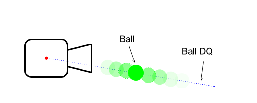

# Motion Capture Master Interface
- [Contents](#contents)
- [Main Python Script](#main-python-script)
    + [Capture Target Diagram](#capture-target-diagram)
    + [Pseudo Code:](#pseudo-code-)
- [Class: BallTracker](#class--balltracker)
  * [Public function definition](#public-function-definition)
- [Supporting Functions:](#supporting-functions-)

<small><i><a href='http://ecotrust-canada.github.io/markdown-toc/'>Table of contents generated with markdown-toc</a></i></small>

## Contents
- [cpp_src](./cpp_src)

 Cpp source for BallTracking processing backend. Current implementation communicated with python frontend using socket
- [Supporting_Files](./Supporting_Files)

 Misc. files include older version of Ball tracker implementation and test scripts.
 * [ColorRanger.py](./Supporting_Files/ColorRanger.py)

   Test script for testing color filter mask value used in the tracking.
- [camera_config](./camera_config)

 Camera calibration and mapping scripts. Calibration is required for accurate operation of the tracker. post-calibration, data is stored in lens_map.sciobj and later read on startup of the BallTracker.py

## Main Python Script

The main python script will handle initialization of all sub-components ex. camera tracking backend for all three camera instances. Control components functioning principle is described as below. If time allows, UI components will be added for visualization and simple operation.

#### Capture Target Diagram
**_Figure 1_**

#### Pseudo Code:  
~~~~
PROGRAM MoCap-Master:
    initialize: camPV_DQ[0,1] //DQ transformation of camera in space
    initialize: hCam[0] = BallTracker(0)
    initialize: hCam[1] = BallTracker(1)
    run = True

    //initialize variables that will be used in loop
    initialize: ball[2]_from_cam[2]_DQ -- 2x2 DQ array
    Initialize: ball[2]_pos -- 2x1 vec3
    Initialize: ball[2]_pos_old = None -- 2x1 vec3

    //initialize processing of first frame before enter loop
    FOR i in 0,1: //camera
        hCam[i].set_next_frame()
    ENDFOR

    //mainloop
    WHILE run:
        //Preforming CV component
        FOR i in 0,1: //camera
            ready = hCam[i].frame_ready(TIMEOUT)
            IF not ready:
                exit()
            ENDIF
        ENDFOR
        FOR i in 0,1:
            hCam[i].set_next_frame()
        ENDFOR

        //Calculating Ball0 and Ball1 position of 3d Space
        error = False
        FOR id in 0,1: //Ball ID
            detected0, ball[id]_from_cam[0]_DQ = hCam[i].get_ball_dq_pov_plucker(camPV_DQ[i])
            detected1, ball[id]_from_cam[1]_DQ = hCam[i].get_ball_dq_pov_plucker(camPV_DQ[i])
            IF detected0 AND detected1:
                err, ptA, ptB = find_closest_point_on_lines(ball[id]_from_cam[0]_DQ, ball[id]_from_cam[1]_DQ)
                IF not err:
                    ball[id]_pos = midpoint(ptA, ptB)
                ELSE:
                    error = True
                    break
                ENDIF
            ELSE:
                error = True
                break
            ENDIF
        ENDFOR

        IF error:
            ball[:]_pos = ball[:]_pos_old
        ELSE:
            ball[:]_pos_old = ball[:]_pos
        ENDIF

        IF not any ball[:]_pos == None:  //make sure wait for first valid data before sending
            //Calculating where Robot needs to be and what orientation
            //ball[0] define where the end effector is located,
            //ball[1] to ball[0] direction, gives orientation.
            xd_DQ = get_taskspace_from_balls(ball[0]_pos, ball[1]_pos)

            //send result to vrep interface
            send_to_vrep(xd_DQ)
        ENDIF

    ENDWHILE
END_PROGRAM
~~~~

## Class: BallTracker

> This class object will handle operation of each camera. That mean for a three
 cameras motion capture setup, the main program will instantiate three instances
 of the Class. The computation loop should be non blocking. That mean program utilizing the Threading
 library for parallel execution.

### Public function definition
> if not specifically specified, function should be non-blocking

1. def \_Constructor_ ( cameraIndex )
   * cameraIndex:
     * camera index or device path depending on the requirement of
      openCV video capture handling
1. def begin_capture()
   * return: bool -- success
     * If the initialization is successful return "True" else is "False"  
1. def get_frame_size ()
   * return: int, int -- x_size, y_size
     * x_size, y_size of the camera Frame
1. def frame_ready ( int )
   * int -- timeout
     * timeout value of how long the function should wait: -1=Inf, 0=no wait
      time
   * return: bool -- ready
     * return true if ball is in frame and new data/frame is ready for extracting.
      else return false when function timed out. (This is a blocking function)
1. def get_ball_position (int)
   * int -- ballID
     * The id of the ball to locate. the ID can be hardcoded with color. Ex.
      Green=0, Red=1
   * return: bool, int, int -- ball_present, x, y
     * Boolean of if the ball with given ID is in frame
     * x, y pixel of where the ball with given ID is located in the camera.
      if ball is not present, function should return the last known position of
      the ball.
1. def get_ball_dq_origin_plucker (int)
   * int -- ballID
     * same as above
   * return: bool, DQ -- ball_present, ball_vec
     * Boolean of if the ball with given ID is in frame
     * Unit DQ of where the ball is pointing from Camera origin Reference Frame.
      Processing of this function should also account for camera lens optical
      distortion. Question of how, should be handled internally as cameras model
      used is the same. Behavior under error condition should be same as previous.   
1. def get_ball_dq_pov_plucker (int, DQ)
   * int -- ballID
      * same as above
   * DQ -- cameraDQ
     * The DQ representing the camera position and facing direction
   * return: bool, DQ -- ball_present, ball_vec
     * Boolean of if the ball with given ID is in frame
     * Unit DQ representing a line in space of where the ball with give ID could
      be located.
1. def \_Destructor_()
   * graceful handling of the exiting process and resource deallocation.

## Supporting Functions:

 > Listed here are the mentioned supporting functions from the pseudo code that the program utilize to calculate necessary information.

- **err, pt1, pt2 = find_closest_points_on_lines(DQ, DQ)**

Single camera typically is only capable of estimating position of an object in 2 Degree of Freedom (DoF) with somewhat desirable accuracy. For this reason, in order to achieve better tracking, Two is the absolute minimum but with some outlying case of error (basically when the target is inline with both camera). For visualization please see **_Figure 2_**. By obtaining the center pixel position of the ball in single camera. This gives a line where the ball could possibly rest (Here will be represented using the Dual Quaternion notation). The function then takes such information from two cameras. and processing it into two points position. What it utilize is similar concept to that of finding shortest distance between two lines in 3D space (**_Figure 3_**). The function then return the Cartesian Coordinate of the two point1 and point2. In the rare case of both actually are near parallel to each other, or calculated ball position is above certain distance from the capture space. error should be returned.

**_Figure 2_**

**_Figure 3_**

- **pt = midpoint(point, point)**

This function takes the output of the above if there is no error and return the midpoint of where the two points connect. Else the output value will be "None/NULL"

- **taskDQ = get_taskspace_from_balls(point0, point1, angle)**

This function will use the Cartesian Coordinate of the two balls described in **_Figure 1_** and return a task space representation of the robot's target.
